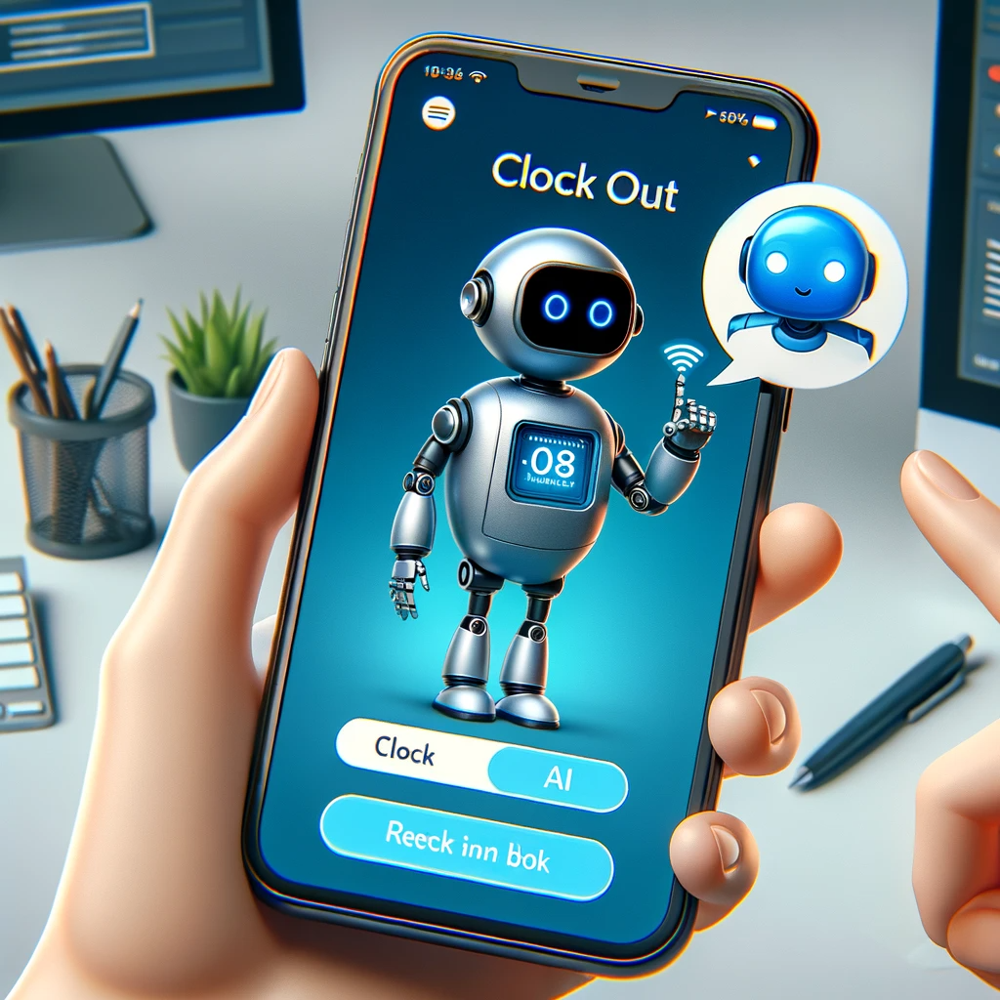

### Reference Application / Companies

# https://app.buddypunch.com/

How would you like your employees to punch in?
You can select more than one and change your selections at anytime.
Username & Password
4 Digit Pin
QR Codes
tag_faces
Facial Recognition
I'm not sure yet
What type of devices will your employees be using to punch in?
You can select more than one and change your selections at anytime.
Desktop/Laptop
Mobile
Tablet
I'm not sure yet


Setup Pay Periods
Frequency

Current Pay Period Start Date
12/02/2023
The start date does not affect the length of your trial.

# -------------------------------------------

here is my outline:

i would like to create a Time Punch (Clock in and clock out time) web app and cross mobile app accessing to the same database. I would like to create the web app locally (first in my computer) and then deploy to cloud services like Azure. There will be front end and backend. Also, we can add additional functions in the future such as projects, ticketings etc as additional modules (again these are sometime in the later future but wanted to keep in mind)

This app will contain two part in the front end. there will be employer section and employees (users) section where each users can Clock in and clockout from their account. Employeers can see all the time entries each employees enters.

Creating a time clock in and clock out app integrated with an AI assistant like ChatGPT can offer several advanced and user-friendly features. Here are some suggestions for your application:



1. **User Authentication**:

   - Secure login/logout.
   - Role-based access (Admin, Manager, Employee).

2. **Time Tracking**:

   - Clock in/out with timestamp.
   - Manual time entry option for missed clock-ins/outs.
   - Weekly time entry views for users.

3. **Natural Language Processing (NLP)**:

   - Use ChatGPT to understand natural language commands for clocking in and out.
   - Examples: "I'm starting my shift", "I'm done for the day", etc.

4. **Dashboard and Reporting**:

   - Real-time dashboard for attendance and hours worked.
   - Generate reports for payroll processing.
   - Analytics for time tracking, like average working hours, overtime, etc.

5. **Notifications and Alerts**:

   - Alerts for when a user forgets to clock in or out.
   - Reminder notifications for shift start and end times.

6. **Integration with Calendars**:

   - Sync with Google Calendar or Outlook for shift schedules.
   - Allow users to see their schedules and upcoming shifts.

7. **Mobile Compatibility**:

   - A mobile-friendly web app or a native mobile application.
   - Geolocation features to ensure employees are at the work site when clocking in.

8. **Leave Management**:

   - Allow users to request time off.
   - Track available leave balances.

9. **Chatbot Interface**:

   - Use the ChatGPT model to answer FAQs about time tracking and company policies.
   - Provide a conversational interface for time management tasks.

10. **Administrative Features**:

    - Approve or modify time entries.
    - Manage user accounts and roles.

11. **Audit Trails**:

    - Keep a log of all actions for compliance and auditing.

12. **API Integration**:

    - Provide APIs for integration with other systems like payroll, HRM, or ERP.

13. **Privacy and Security**:

    - Ensure data privacy and security, especially with GDPR and other regulations.

14. **Scalability**:

    - Design the app to handle a growing number of users and data points efficiently.

15. **Customization**:

    - Allow users to customize notifications, reports, and dashboard views.

16. **OpenAI API Integration**:

    - Use OpenAI's API for enhanced NLP capabilities and data analysis.
    - Generate summaries of work hours and insights using GPT models.

17. **Voice Commands**:
    - Integrate with virtual assistants like Google Assistant, Siri, or Alexa for voice-enabled clock-ins and outs.

When integrating ChatGPT or any AI assistant, consider the following:

- **Ease of Use**: The AI should simplify tasks, not complicate them. Ensure the commands are intuitive.
- **Fallback Options**: If the AI does not understand a command, there should be easy fallback options for manual input.
- **User Training**: Provide guidance on how to interact with the AI for clocking in and out.

Finally, ensure your app is compliant with labor laws and respects user privacy. The integration of ChatGPT should adhere to OpenAI's use-case policies and any data protection regulations relevant to your user base.

<hr>
The application you are developing can certainly be designed to accommodate multiple users or companies, making it a versatile and scalable solution. Here are a few aspects to consider for such a multi-tenant application:

1. **User and Company Registration**:

   - Allow companies to sign up and create their own accounts.
   - Each company can have its own set of employees, managers, and administrators.

2. **Multi-Tenancy Architecture**:

   - Implement a multi-tenant architecture where data from different companies are isolated from each other for privacy and security.
   - You could use separate databases for each company (multi-database approach) or a single database with tenant identification in each table (shared database approach).

3. **Customization for Each Tenant**:

   - Enable customization options such as branding, specific policies, and workflow settings for each company.
   - Allow companies to set their own time tracking rules, approval workflows, etc.

4. **Role-Based Access Control (RBAC)**:

   - Implement RBAC to manage user permissions within each company.
   - For instance, a user might be an employee in one company and a manager in another.

5. **Billing and Subscription Management**:

   - If you plan to charge for the service, implement a subscription model with different tiers based on features, number of users, etc.
   - Integrate a payment gateway for handling subscriptions.

6. **Scalability and Performance**:

   - Ensure the application scales well with an increasing number of companies and users.
   - Optimize database queries and server resources.

7. **Support and Documentation**:

   - Provide detailed documentation and support for companies to onboard and use the application effectively.
   - Include FAQs, user guides, and video tutorials.

8. **Compliance and Data Protection**:

   - Adhere to relevant data protection laws (like GDPR or HIPAA) since you will be handling data from multiple entities.
   - Implement robust security measures to protect sensitive data.

9. **Reporting and Analytics**:

   - Offer comprehensive reporting tools for companies to track time, analyze productivity, and generate payroll reports.
   - Allow exporting of data for external analysis.

10. **APIs for Integration**:

    - Provide APIs for integration with other business systems like HRMS, payroll, or project management tools.

11. **Feedback and Continuous Improvement**:
    - Regularly collect feedback from companies and users to improve the application.

Designing for multiple users and companies brings complexity but also opens up opportunities for a wider market reach. It's important to plan meticulously, focusing on security, privacy, user experience, and legal compliance. Additionally, consider the infrastructure costs and maintenance requirements of a multi-tenant system, as they can be significantly higher than a single-tenant application.

<hr>
Certainly! Creating a scalable, easy-to-deploy time tracking application for businesses involves several key components and considerations. Below is a detailed outline, including recommendations for databases and deployment strategies.

### Outline for Time Tracking Application

1. **Application Components**:

   - **Frontend**: User interface for interaction. Can be a web app (using React, Vue.js, etc.) or a mobile app (using Flutter, React Native).
   - **Backend**: Server-side logic (consider Flask or Django for Python; Node.js for JavaScript).
   - **Database**: Stores user data, time entries, company information.

2. **User and Company Management**:

   - **Registration and Authentication**: Enable companies and users to register and log in. Implement OAuth for social logins if needed.
   - **Profile Management**: Users can manage their profiles, change passwords, etc.
   - **Multi-Tenant Support**: Ensure data isolation between different companies.

3. **Time Tracking Features**:

   - **Clock In/Out**: Manual and automatic (based on location or schedule).
   - **Breaks and Overtime**: Track breaks and automatically calculate overtime.
   - **Approvals and Corrections**: Allow managers to approve or correct time entries.
   - **Notifications**: Reminders for clocking in/out and approvals.

4. **Reporting and Analytics**:

   - **Timesheet Reports**: Generate weekly, monthly, or custom period reports.
   - **Analytics Dashboard**: Visualize time data, identify trends, calculate payrolls.

5. **Integrations**:

   - **APIs**: Develop APIs for integration with third-party services (HR systems, project management tools).
   - **Webhooks**: For real-time data synchronization with other systems.

6. **Database Selection**:

   - **For Startups/Small Scale**: PostgreSQL or MySQL. They are robust, open-source, and offer good performance.
   - **For Scalability and Growth**: Consider cloud databases like Amazon RDS, Google Cloud SQL, or managed PostgreSQL services for scalability and reliability.

7. **Deployment and Hosting**:

   - **Platform**: Use platforms like Heroku, AWS, or Google Cloud for easy deployment and scaling.
   - **Containerization**: Use Docker for containerizing the app, ensuring easy deployment and consistency across environments.
   - **CI/CD Pipelines**: Implement continuous integration and deployment for automated testing and deployment using tools like Jenkins, GitLab CI, or GitHub Actions.

8. **Security and Compliance**:

   - **Data Encryption**: In transit (SSL/TLS) and at rest.
   - **Regular Security Audits**: To identify and fix vulnerabilities.
   - **Compliance**: Follow GDPR, HIPAA, or other relevant regulations.

9. **Scalability Considerations**:

   - **Microservices Architecture**: For future scalability, consider adopting a microservices architecture.
   - **Load Balancing**: Use load balancers to distribute traffic and improve app responsiveness.
   - **Database Optimization**: Regularly optimize database queries and indices for performance.

10. **User Feedback and Support**:

    - **Support System**: Implement a ticketing system for user support.
    - **Feedback Loop**: Regularly collect and analyze user feedback for improvements.

11. **Documentation and Training**:

    - **User Guides**: Create comprehensive user manuals and guides.
    - **Developer Documentation**: Ensure code is well-documented for future development.

12. **Backup and Recovery**:

    - **Data Backup**: Regular backups of the database and critical data.
    - **Disaster Recovery Plan**: Plan for data recovery in case of system failures.

13. **Cost Management**:

    - **Cost-effective Solutions**: Initially, choose cost-effective hosting and services.
    - **Monitoring Usage**: Regularly monitor resource usage and optimize to cut unnecessary costs.

14. **Monitoring and Logging**:

    - **Performance Monitoring**: Tools like New Relic or Datadog for monitoring app performance.
    - **Logging**: Implement comprehensive logging for debugging and monitoring.

15. **Marketing and Launch**:

    - **Beta Testing**: Conduct thorough beta testing with real users.
    - **Launch Strategy**: Plan a marketing strategy for app launch, targeting the right audience.

16. **Future Growth and Expansion**:
    - **Feature Roadmap**: Plan for future features and improvements.
    - **Scalable Infrastructure**: Ensure infrastructure can handle growth in users and data.

By starting with a robust foundation and keeping scalability in mind, you can build an application that not only meets current needs but is also ready for future expansion. This approach allows for gradual growth and adaptation as the user base and feature set expand.

<hr>
Given your project's scope and requirements, Django does seem like a better fit for several reasons:

1. **Multi-Tenant Architecture**: Django's robust ORM and middleware capabilities can efficiently handle a multi-tenant architecture. This is crucial for a system where multiple companies or users will sign up and use the application independently.

2. **Built-In User Authentication**: Django comes with a comprehensive user authentication system. It can manage user accounts, groups, permissions, and cookie-based user sessions. This is especially useful for your application, which will require differentiated access for businesses and their employees.

3. **Admin Interface**: Django's automatic admin interface can be a significant time-saver. It provides a ready-to-use UI for site administrators to interact with the database. This feature can be particularly beneficial for managing large amounts of user data and timesheet entries.

4. **Scalability**: Django is designed to efficiently manage large-scale applications. As your application grows in the future, Django’s ability to handle complexity will be advantageous.

5. **Reporting and Data Analysis**: Django’s ORM provides powerful tools for querying the database, which is essential for generating reports and analyzing time tracking data.

6. **Extensibility and Plugins**: Django has a large ecosystem of third-party applications. You can leverage these plugins to add functionalities like REST API capabilities, which could be necessary for integrating ChatGPT or other AI assistants.

7. **Rapid Development**: With Django's batteries-included approach, you can develop features like user registration, login, and CRUD operations for time entries more quickly.

### Conclusion

For a project that requires robust user management, scalability, and the capability to handle complex data operations and reporting, Django offers a more comprehensive framework out of the box compared to Flask. This aligns well with your need for a scalable, multi-tenant time tracking application with potential for future growth and integration with AI technologies like ChatGPT.

<hr>
Choosing between <b>Flask and Django</b> for your Python backend depends on several factors, including the complexity of your application, the need for scalability, and the speed of development. Here's a comparison to help you decide:

### Flask

- **Simplicity and Flexibility**: Flask is a micro-framework, which means it comes with minimal built-in tools. This simplicity makes it easier to get started quickly, especially for smaller applications or prototypes.
- **Flexibility**: You have the freedom to choose your tools and libraries, making Flask highly customizable.
- **Learning Curve**: Easier for beginners or those who prefer to build their application piece by piece.
- **Performance**: Generally faster and lighter, which can be beneficial for simpler applications.
- **Scalability**: Flask can scale well, but you might need to manually integrate more features or third-party services as your app grows.

### Django

- **Batteries-included Approach**: Django follows a "batteries-included" philosophy, providing a wide range of built-in features such as an ORM (Object-Relational Mapper), admin interface, and authentication support.
- **Rapid Development**: These built-in features enable quicker development of complex applications.
- **Structured and Monolithic**: Django encourages a specific way of doing things, which can be beneficial for maintaining code standards, especially in larger teams.
- **Scalability**: Django is designed to handle high traffic and complex data-driven websites efficiently. It's used by large platforms like Instagram and Pinterest.
- **Learning Curve**: Steeper than Flask due to its many components and more rigid structure.

### Conclusion

- **Starting Quickly**: Flask allows you to start quickly, especially for simpler applications. It's excellent for learning and small projects.
- **Scaling Up**: Both Flask and Django can scale efficiently. Django might offer a smoother scaling experience for very complex applications due to its integrated features.

### Recommendation

- If you anticipate that your application will become highly complex or you value having many features available out-of-the-box, Django is a good choice.
- If you prefer starting with something simpler and more flexible, and are comfortable assembling the pieces as you go, Flask is ideal.

For your time tracking application, if you want more control over the architecture and are starting with relatively simple requirements, Flask might be the way to go. However, if you foresee needing the extensive features that Django offers (like a built-in admin panel, user authentication, etc.) and prefer a more structured framework, Django would be a better fit.

<hr>
Before you get started with developing your Django-based time tracking application, here's a checklist of what you need:

### For You:

1. **Python Installation**: Ensure you have Python installed on your system. Django is a Python framework, so Python is a prerequisite.

2. **Django Installation**: Install Django. You can do this using pip (Python’s package installer) with the command `pip install django`.

3. **Database Setup**: Decide on a database. Django works well with several database systems like PostgreSQL, MySQL, SQLite, etc. For development, SQLite is simple and easy, but for production, PostgreSQL or MySQL are recommended for scalability and features.

4. **Development Environment**: Set up your development environment. This could be an IDE (like PyCharm, VS Code) or a simple text editor.

5. **Version Control**: It's good practice to use version control (like Git) for your project. This helps in managing different versions of your code and collaborating with others if needed.

6. **Familiarity with Django**: Basic knowledge of Django will be helpful. If you're new to Django, consider going through Django’s official tutorial or other online resources.

7. **Frontend Technologies**: Decide on the technologies for your frontend (HTML, CSS, JavaScript, etc.). Django comes with its templating engine, but you can also use frontend frameworks like React or Vue if needed.

8. **Web Hosting and Deployment Knowledge**: Plan how you'll host and deploy your app. Familiarize yourself with web servers like Gunicorn or uWSGI and platforms like Heroku, AWS, or DigitalOcean.

### For Me (ChatGPT):

1. **Specific Questions or Tasks**: I can help with answering specific questions about Django, Python, database design, and web development best practices.

2. **Code Snippets and Debugging Help**: I can provide code snippets, help debug issues, or explain concepts related to Django and web development.

3. **Guidance on Best Practices**: I can offer advice on Django best practices, project structure, security considerations, and performance optimization.

4. **Integration Guidance**: If you plan to integrate ChatGPT or other AI models, I can provide guidance on API integration and potential use-cases.

5. **Resource Recommendations**: I can recommend tutorials, documentation, and other learning resources.

### Getting Started

Once you're set up with the above, you can start by creating a new Django project and setting up your application structure. Begin with creating models for your users, time entries, and possibly companies (if you're considering a multi-tenant setup). Then, you can move on to creating views, templates, and setting up the admin interface for basic CRUD operations.

<hr>
Before you get started with developing your Django-based time tracking application, here's a checklist of what you need:

### For You:

1. **Python Installation**: Ensure you have Python installed on your system. Django is a Python framework, so Python is a prerequisite.

2. **Django Installation**: Install Django. You can do this using pip (Python’s package installer) with the command `pip install django`.

3. **Database Setup**: Decide on a database. Django works well with several database systems like PostgreSQL, MySQL, SQLite, etc. For development, SQLite is simple and easy, but for production, PostgreSQL or MySQL are recommended for scalability and features.

4. **Development Environment**: Set up your development environment. This could be an IDE (like PyCharm, VS Code) or a simple text editor.

5. **Version Control**: It's good practice to use version control (like Git) for your project. This helps in managing different versions of your code and collaborating with others if needed.

6. **Familiarity with Django**: Basic knowledge of Django will be helpful. If you're new to Django, consider going through Django’s official tutorial or other online resources.

7. **Frontend Technologies**: Decide on the technologies for your frontend (HTML, CSS, JavaScript, etc.). Django comes with its templating engine, but you can also use frontend frameworks like React or Vue if needed.

8. **Web Hosting and Deployment Knowledge**: Plan how you'll host and deploy your app. Familiarize yourself with web servers like Gunicorn or uWSGI and platforms like Heroku, AWS, or DigitalOcean.

### For Me (ChatGPT):

1. **Specific Questions or Tasks**: I can help with answering specific questions about Django, Python, database design, and web development best practices.

2. **Code Snippets and Debugging Help**: I can provide code snippets, help debug issues, or explain concepts related to Django and web development.

3. **Guidance on Best Practices**: I can offer advice on Django best practices, project structure, security considerations, and performance optimization.

4. **Integration Guidance**: If you plan to integrate ChatGPT or other AI models, I can provide guidance on API integration and potential use-cases.

5. **Resource Recommendations**: I can recommend tutorials, documentation, and other learning resources.

### Getting Started

Once you're set up with the above, you can start by creating a new Django project and setting up your application structure. Begin with creating models for your users, time entries, and possibly companies (if you're considering a multi-tenant setup). Then, you can move on to creating views, templates, and setting up the admin interface for basic CRUD operations.

## ----------------------------------------

Great to hear that the URL and path issues are resolved! Let's move forward with the next steps in developing your time-tracking application.

### Next Steps: Enhancing Functionality and Security

1. **User Authentication & Authorization**:

   - Ensure secure handling of user sessions and permissions.
   - Implement password reset functionality.
   - Consider using Django’s built-in views and forms for authentication (e.g., `PasswordChangeForm`, `PasswordResetForm`).

2. **Profile Management**:

   - Allow users to view and edit their profiles.
   - Implement profile picture upload (consider using Django’s `ImageField`).

3. **Time Entry Management**:

   - Implement CRUD (Create, Read, Update, Delete) operations for time entries.
   - Enable filtering and searching of time entries.
   - Implement validation to ensure clock-out time is after clock-in time.

4. **Reporting**:

   - Develop detailed reports for users and administrators (e.g., total hours worked, average hours per day).
   - Implement export functionality (e.g., PDF, Excel).

5. **Integrating ChatGPT**:

   - Utilize OpenAI's API to integrate ChatGPT for natural language processing tasks.
   - Consider features like interpreting user commands for clocking in/out or generating summaries of time entries.

6. **Testing**:

   - Write unit tests and integration tests to ensure the reliability of your application.
   - Use Django’s test framework (`django.test.TestCase`) for this purpose.

7. **Front-end Development**:

   - Enhance the UI/UX with CSS frameworks like Bootstrap or Materialize.
   - Consider using JavaScript or a front-end framework like React or Vue.js for dynamic content.

8. **API Development (Optional)**:

   - If you plan to have a mobile app or third-party integrations, develop a RESTful API using Django REST framework.

9. **Security Enhancements**:

   - Implement CSRF protection (Django has built-in support).
   - Regularly update dependencies to mitigate vulnerabilities.
   - Use HTTPS for all production traffic.

10. **Deployment**:

- Prepare your application for deployment (consider using services like Heroku, AWS, or DigitalOcean).
- Set up a continuous integration/continuous deployment (CI/CD) pipeline.

### Moving Forward

Each of these steps requires detailed implementation. Let me know which specific area you want to focus on next, and I'll provide step-by-step guidance and code examples as needed!

---

For organizing your CSS files in a Django project, it's recommended to follow a structure that allows for both modularity and maintainability. Here's a suggested approach:

1. **Create a Static Directory**: In a Django project, static files (like CSS, JavaScript, and images) are typically stored in a directory named `static`. This directory can be at the project level or inside individual apps, depending on how you want to organize your files. For a CSS file that will be used across the entire project, it's logical to place it at the project level.

2. **Directory Structure**:

   - Create a `static` directory in your project's root directory (the same directory where `manage.py` is located).
   - Inside the `static` directory, create a subdirectory named `css`.
   - Save your `punchin.css` file inside the `static/css` directory.

3. **Project Directory Structure Example**:

   ```
   myproject/
   ├── myproject/
   │   ├── __init__.py
   │   ├── asgi.py
   │   ├── settings.py
   │   ├── urls.py
   │   └── wsgi.py
   ├── app1/
   ├── app2/
   ├── static/
   │   ├── css/
   │   │   └── punchin.css
   │   ├── js/
   │   └── images/
   ├── templates/
   ├── db.sqlite3
   └── manage.py
   ```

4. **Referencing the CSS File in Templates**: To use the CSS file in your templates, you will first need to ensure that Django can find your static files. In your `settings.py`, make sure you have defined `STATIC_URL`:

   ```python
   STATIC_URL = '/static/'
   ```

   In your templates, especially the `base.html`, load the static files and reference the CSS file:

   ```html
   

   <!DOCTYPE html>
   <html>
     <head>
       <!-- Other head elements -->
       <link href="" rel="stylesheet" />
     </head>
     <body>
       <!-- Your content goes here -->
     </body>
   </html>
   ```

5. **Collecting Static Files**: In production, you'll need to run `python manage.py collectstatic` to collect all static files into a single directory that you can serve.

## This structure allows you to keep your CSS organized and easy to manage, especially as your project grows. You can also create separate CSS files for specific components or pages and store them in the `static/css` directory, keeping your styles modular and manageable.

Great to hear that your application is coming together! Based on our previous discussions and your project goals, the next steps to consider for your time-tracking application might include:

1. **User and Employer Linking:**

   - Implement a feature where users can link their account to an employer.
   - Develop an invitation system where employers can invite employees to join under their company. This would involve generating unique invitation codes or links that employees can use to associate their account with the employer.

2. **Employer Account Management:**

   - Allow businesses to sign up as employers.
   - Create a dashboard for employers to view and manage employee time entries, generate reports, and handle account settings.

3. **Enhancing User Profile:**

   - Add more functionalities to the user profile, like updating personal information, changing passwords, and viewing their time entries.

4. **Time Entry Management:**

   - Improve the time entry system where employees can clock in and out. Consider integrating options for manual time entry and using natural language processing (NLP) for more intuitive interactions.

5. **Reporting Features:**

   - Develop a robust reporting system where employers can generate detailed reports about time entries, employee performance, etc. This can utilize GPT models for data analysis and presentation.

6. **Security and Permissions:**

   - Ensure that user data is secure and that appropriate permissions are set so employees can only see their data, while employers can see data across their organization.

7. **Testing:**

   - Implement thorough testing for all features, including unit tests, integration tests, and user acceptance testing.

8. **UI/UX Enhancements:**

   - Continuously improve the user interface and user experience based on feedback and user testing.

9. **Documentation and Help Guides:**

   - Create user guides and documentation for both employees and employers to navigate through the application easily.

10. **Future Expansion and Scalability:**
    - Plan for future features like integration with other tools (calendars, project management software, etc.), mobile app development, or AI-driven insights for time management.

Each of these steps involves multiple tasks, from backend development to front-end design and user experience improvements. Let me know which specific area you'd like to focus on next, and I can provide more detailed guidance and assistance!

Run collectstatic if in production:
If your project is in production, you will need to run the collectstatic command to gather all static files into the STATIC_ROOT:

Copy code
python manage.py collectstatic
This isn't necessary during development if you have DEBUG = True and are using runserver.

For the registration page not formatting correctly, here are some steps:
